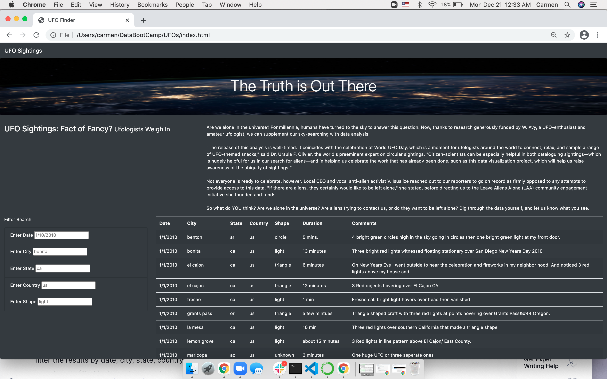
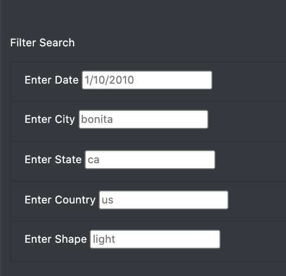

# UFOs

## Overview of Project: Explain the purpose of this analysis.

Dana’s webpage and dynamic table are working as intended, but she’d like to provide a more in-depth analysis of UFO sightings by allowing users to filter for multiple criteria at the same time.

We are to create a table to organize UFO data that is stored as a JavaScript array, or list. The table will have the ability to filter data based on certain criteria using JavaScript.

## Results: 

When the UFO sighting website loads, you will see a list of UFO sighting data as you scroll. The website can be overwhelming to look at all the data.

When you go to the Filter Search box, you have the option to filter out the Date, City, State, Country, and Shape of the UFO sighting. 

If you want to remove a certain filter, you simply delete it in the box.

## Summary:

One drawback of this webpage would be that there so much going on, and it can be excessive to look at. It discourages people from looking at the website. I have two recommendations for further development. Add a function to only have a certain amount of searches on a page and have a next page button on the bottom for more. Another recommendation would to add a filter in the search box and provide the available input search to make searches easier.